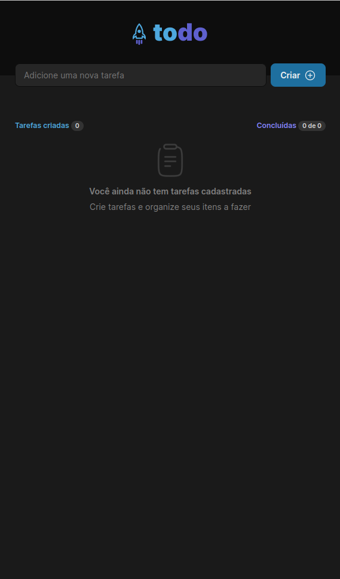
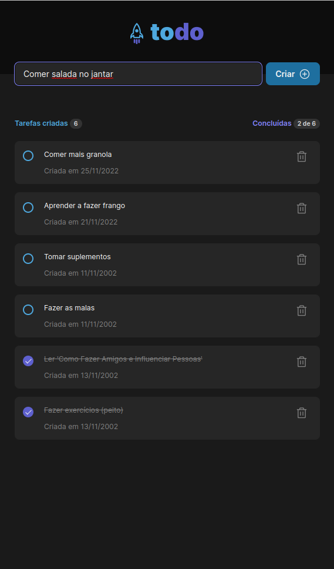

# Todo List
<!--  -->

      |  
:-------------------------:|:-------------------------:

<a href="https://damasio-todo.netlify.app">Live Project 👽</a>
        
## About the project 💻
This is a challenge from the first chapter of Rocketseat's Ignite classes.

Users should be able to:
- See their taks, and if they are done or not
- Add new tasks
- Delete specific tasks

Tecnologies I'm using:
- CSS Modules
- React.js
- TypeScript

Libraries:
- Phosphor Icons
- date-fns (for better formatting dates)

## Things I want to add to this project 👨‍💻
The best way to learn is to make projects yourself (as I'm doing now 🙃) and to try to add cool features to those projects.

Some features I want to add are:
- ~~Tasks go to the bottom of the list when completed~~
- Drag-and-drop functionality
- Hide tasks that are already done
- Change favicon and title of the website

## Difficulties I faced 🤷‍♂️
### TypeScript 
This is my first time using TypeScript by myself
I faced a lot of difficulties when it comes to types, passing props and specifying their types and etc...
I would say 35% of the time spent in this project was just for correcting TypeScript errors

### React Hooks 
There were some behaviors and 'tricks' about the useState hook that I didn't know before and had to learn as I built this app.
Things like:
- React re-rendering components when state changes
- How to use less useState hooks to build functionalities

I also learned the useEffect hook while build the app. Didn't have any problems with it

## Things I could do to build a better project 👨‍🏭
1. Plan how the functionalities of the app will be built
2. More patience when it comes to adding extra functionalities. (I saw how an easy-to-read code can become a mess if you just begin to add too much functionalities)
3. Think about how CSS will play out with the functionalities of app (I had to re-write a lot of CSS after I added functionality to the project)

## What I learned 👨‍🏫
- How to better plan the structure (HTML), styles (CSS) and functionalities (JS) of an application by looking at a design/mockup
- How to think in a 'React way' (passing props, immutability, callback functions and etc)
- How to use TypeScript with React (still have to work in this tho)
- How to use the React's useState hook efficiently
- How to use the useEffect hook to make the application more dynamic
- How to make a custom checkbox myself
